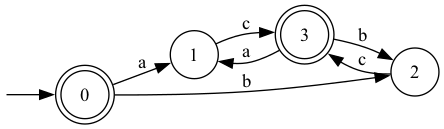

# Regex Engine

A regular expression engine implementation in OCaml that converts regex patterns into finite automata for pattern matching.

## Building

```bash
dune build
```

## Running

```bash
dune exec regex_engine
```

## Example

```ocaml
let () = 
  let dfa = regex_to_dfa (parse "((a|b)c)*") in
  save_dfa_as_dot_file "dfa.dot" dfa
```
```bash
dot -Tpng dfa.dot -o dfa.png
```



## Project structure

```bash
.
├── bin
│   ├── dune
│   └── main.ml
├── dune-project
├── lib
│   ├── ast.ml
│   ├── dfa.ml
│   ├── dune
│   └── nfa.ml
├── README.md
└── regex_engine.opam
```